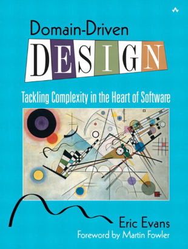
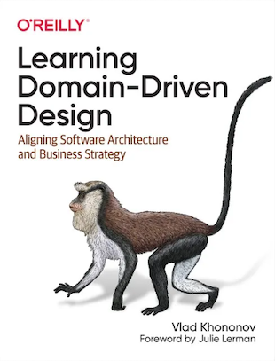
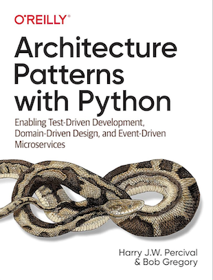
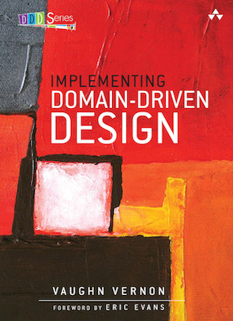

# References

- Domain-Driven Design by Eric Evans
- Learning Domain-Driven Design by Vlad Khononov
- Architecture Patterns with Python by Harry Percival, Bob Gregory
- Implementing Domain-Driven Design by Vernon Vaughn
- Domain-Driven Design Europe on YouTube

